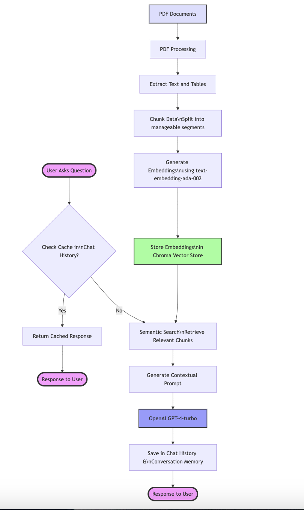

# An OpenAI and RAG-Powered Chat bot for Internship Program Assistance

## Overview
This chatbot is designed to assist students at the University of New Hampshire (UNH) with internship-related queries. It dynamically retrieves information from multiple PDF documents using Retrieval-Augmented Generation (RAG) techniques and provides conversational, context-aware responses. The chatbot integrates **Flask**, **LangChain**, **Chroma**, and **OpenAI's GPT-4 Turbo**.

## Key Components
### Preprocessing
- **PDF Extraction**: Extracts text and table data using `pdfplumber`.
- **Chunking**: Splits text into smaller, manageable chunks using `RecursiveCharacterTextSplitter` and custom week-based logic.
- **Embeddings**: Converts text chunks into embeddings using OpenAI's `text-embedding-ada-002`.
- **Storage**: Saves embeddings in Chroma for efficient similarity-based searches.

### Query Handling
- **Input Validation**: Ensures valid input from the user.
- **Cached Response**: Checks if the query has been answered before and retrieves it from the cache.
- **Similarity Search**: Retrieves relevant chunks from the Chroma database.
- **Custom Prompt**: Dynamically formats retrieved content and past chat history into a structured prompt.
- **Response Generation**: Uses GPT-4 Turbo to generate a conversational and context-aware response.

### Post-Processing
- **Memory Update**: Stores the last 5 interactions (questions and answers) in `conversation_memory.json` for handling follow-up questions.
- **Caching**: Saves new questions, responses, and their corresponding hashes in `chat_history.json` to reduce redundant API calls.

## Architecture Diagram


## Setup and Installation

### Prerequisites
- Python 3.8+
- OpenAI API Key
- Flask
- LangChain
- Chroma

## Creating an OpenAI API Key
To use OpenAI's GPT-4 API, you need to create an API key from OpenAI's platform.

1. **Sign up or log in to OpenAI**:
   - Visit [OpenAI's website](https://platform.openai.com/signup/) and create an account or log in to your existing account.

2. **Create an API key**:
   - Navigate to the **API Keys** section under your OpenAI dashboard.
   - Click on "Create API Key."
   - Copy the generated API key and store it securely.

## Adding Credits to OpenAI Account
To ensure your API key has sufficient credits for usage:

1. **Log in to OpenAI**:
   - Visit [OpenAI's website](https://platform.openai.com/login) and log in to your account.

2. **Navigate to Billing**:
   - Go to the **Billing** section on the OpenAI dashboard.

3. **Add a payment method**:
   - Add your credit/debit card or other payment methods to your OpenAI account.

4. **Purchase Credits**:
   - In the billing section, choose a payment plan or purchase credits as needed.
   - Ensure you monitor your API usage to avoid exceeding your credits.

5. **Check Remaining Credits**:
   - Under **Usage** on the OpenAI dashboard, you can monitor your credit usage and remaining balance.

---

By following these steps, you can ensure your OpenAI API key is properly set up and has sufficient credits for smooth operation of your chatbot.


### Installation
1. Clone the repository:
   ```bash
   git clone https://github.com/UNHM-TEAM-PROJECT/Fall2024-Team-Gulliver.git TeamGulliver
   cd TeamGulliver
2. Create a virtual environment:
   ```bash
   python -m venv venv
   # on Mac/linux: source venv/bin/activate   
   # On Windows: venv\Scripts\activate
3. Install dependencies:
    ```bash
    pip install -r requirements.txt
4. Set your OpenAI API key as an environment variable:
   - **Linux/MacOS**:
     ```bash
     export OPENAI_API_KEY="your-openai-api-key"
     echo $OPENAI_API_KEY  # To verify the key is exported correctly
     ```
   - **Windows**:
     ```cmd
     set OPENAI_API_KEY="your-openai-api-key"
     echo %OPENAI_API_KEY%  # To verify the key is exported correctly
     ```

---

## Usage
1. Place the PDF documents in the `data/` directory.
2. **Change the path to your local directory**:
   - Open the `chatbot.py` file.
   - Update the `PDF_PATH` variable to point to your local directory containing the PDFs. For example:
     ```python
     PDF_PATH = "your_local_path_to_pdfs"
     ```
3. Run the chatbot:
   ```bash
   python chatbot.py
4. Open your browser and navigate to:
   ```bash
   http://127.0.0.1:5000/
5. Ask internship-related questions, e.g., "What are the requirements for COMP690?"

## Automated Testing

Automated testing scripts are located in the `automated_testing/` folder. These scripts are used to evaluate the chatbot's performance by comparing generated answers with reference answers. They use similarity scoring to calculate accuracy efficiently.

For detailed instructions on setting up and running automated tests, refer to the dedicated `README.md` file located in the `automated_testing/` folder.

### Important Notes:
- The `testing/` folder contains earlier testing scripts that are **not relevant** to the current project. These were created during the initial phases of the sprint and should be ignored.
- The `test_chatbot.py` file is also **not relevant** and can be ignored for current testing purposes.
- For accurate evaluation, focus only on the scripts and instructions provided in the `automated_testing/` folder.

